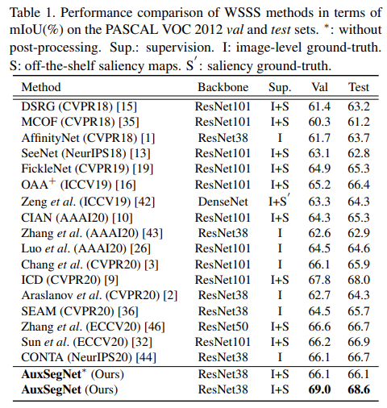
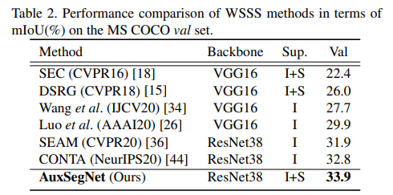
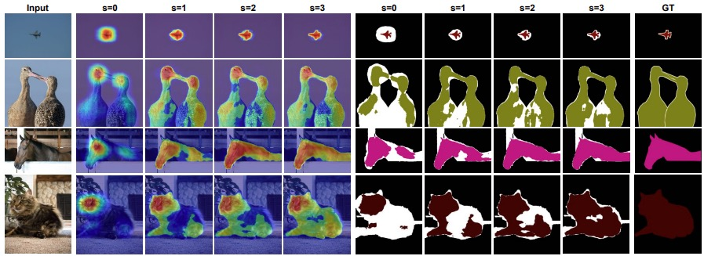

# AuxSegNet

The pytorch code for our ICCV 2021 paper [Leveraging Auxiliary Tasks with Affinity Learning for Weakly Supervised Semantic Segmentation](https://arxiv.org/abs/2107.11787).

<p align="left">
  
</p>

## Prerequisite
- Ubuntu 18.04, with Python 3.6 and the following python dependencies.
```
pip install -r prerequisite.txt
```
- Download [the PASCAL VOC 2012 development kit](http://host.robots.ox.ac.uk/pascal/VOC/voc2012).

## Usage


#### 1. Prepare initial pseudo labels
- Off-the-shelf saliency maps used as the initial saliency pseudo labels. [[DSS]](https://drive.google.com/open?id=1Ls2HBtg3jUiuk3WUuMtdUOVUFCgvE8IX)
- Extract the class activation maps (CAM) from a pre-trained single-task classification network. [[ResNet38]](https://drive.google.com/file/d/1xESB7017zlZHqxEWuh1Rb89UhjTGIKOA/view?usp=sharing)
- Generate the initial pseudo segmentation labels using the above saliency and CAM maps via [[heuristic fusion]](https://github.com/xulianuwa/AuxSegNet/blob/597506a4f44cca81d11c986217e5318361e8f65e/tool/imutils.py#L36).
#### 2. Train the AuxSegNet

```
python train_AuxAff.py --img_path 'Path to the training images'\
                       --seg_pgt_path 'Path to the pseudo segmentation labels' \
                       --sal_pgt_path 'Path to the pseudo saliency labels' \
                       --init_weights 'Path to the initialization weights' \
                       --save_path 'Path to save the trained AuxSegNet model' 
```


#### 3. Pseudo label updating
```
python gen_pgt.py --weights 'path to the trained AuxSegNet weights'\   
                  --img_path 'Path to the training images'\
                  --SALpath 'Path to the pre-trained saliency maps' \
                  --seg_pgt_path 'Path to save updated pseudo segmentation labels' \
                  --sal_pgt_path 'Path to save updated pseudo saliency labels' 
```
#### 4. Iterate Step 2 and 3

#### (Optional) Integrated iterative model learning and label updating (Step 2-4) 
```
bash iter_learn.sh
```
#### 5. Inference
```
python infer_AuxAff.py --img_path 'Path to the training images'\
                       --weights 'Path to the trained AuxSegNet weights'\
                       --save_path 'Path to save the segmentation results'

```
## Performance comparison with SOTA 

Segmentation results on the PASCAL VOC 2012 dataset

<p align="left">
  
</p>

[comment]: <> (| Method         | Val &#40;mIoU&#41;    | Test &#40;mIoU&#41;    | )

[comment]: <> (| ------------- |:-------------:|:-----:|)

[comment]: <> (|ICD &#40;CVPR20&#41;|67.8|68.0|)

[comment]: <> (|Zhang et al. &#40;ECCV20&#41;|66.6|66.7|)

[comment]: <> (|Sun et al. &#40;ECCV20&#41;|66.2|66.9|)

[comment]: <> (| AuxSegNet &#40;ours&#41;     | **69.0** | **68.6** | )

Segmentation results on the MS COCO dataset
<p align="left">
  
</p>

<p align="left">
  
</p>

## Citation
Please consider citing our paper if the code is helpful in your research and development.
```
@inproceedings{xu2021leveraging,
  title={Leveraging Auxiliary Tasks with Affinity Learning for Weakly Supervised Semantic Segmentation},
  author={Xu, Lian and Ouyang, Wanli and Bennamoun, Mohammed and Boussaid, Farid and Sohel, Ferdous and Xu, Dan},
  booktitle={Proceedings of the IEEE/CVF International Conference on Computer Vision (ICCV)},
  year={2021}
}
```
